## About

[XxxXTeam](https://github.com/XxxXTeam) 核心成员，专注 API 逆向工程与全栈开发。

- 主力语言：**Go / TypeScript / Python**
- 方向：API 架构设计、浏览器自动化、Bot 生态开发
- 当前：构建高可用 API 代理服务与开源工具链

## Tech Stack

| 分类 | 技术 |
|:---:|:---|
| 语言 |     |
| 前端 |      |
| 后端 |     |
| 自动化 |     |
| 网络工具 |   |
| 基础设施 |      |

## GitHub Stats

 

 

<picture>
  <source media="(prefers-color-scheme: dark)" srcset="https://raw.githubusercontent.com/chanhanzhan/chanhanzhan/output/github-snake-dark.svg" />
  <source media="(prefers-color-scheme: light)" srcset="https://raw.githubusercontent.com/chanhanzhan/chanhanzhan/output/github-snake.svg" />
  
</picture>

## Featured Projects

## XxxXTeam

&nbsp;专注 API 逆向与工具生态的开源组织

| 项目 | 简介 | 语言 | Stars |
|:---|:---|:---:|:---:|
| [business2api](https://github.com/XxxXTeam/business2api) | Gemini Business API 代理（OpenAI 兼容） | Go |  |
| [flowith2api_deno](https://github.com/XxxXTeam/flowith2api_deno) | Flowith API 代理 | TS |  |
| [chatgpt-plugin](https://github.com/XxxXTeam/chatgpt-plugin) | ChatAI 附属插件 | JS |  |
| [chatai-plugin](https://github.com/XxxXTeam/chatai-plugin) | Yunzai AI 聊天插件 | JS |  |
| [zai2api](https://github.com/XxxXTeam/zai2api) | Z.AI 转 OpenAI 兼容 API | Go |  |
| [flowith2pool](https://github.com/XxxXTeam/flowith2pool) | Flowith 账号池 | JS |  |
| [geminiweb2api](https://github.com/XxxXTeam/geminiweb2api) | Gemini Web API 代理 | Go |  |
| [AliMPay](https://github.com/XxxXTeam/AliMPay) | 支付宝码支付系统 | Go |  |
| [GkiPass](https://github.com/XxxXTeam/GkiPass) | 高性能转发面板 | Go |  |

---

